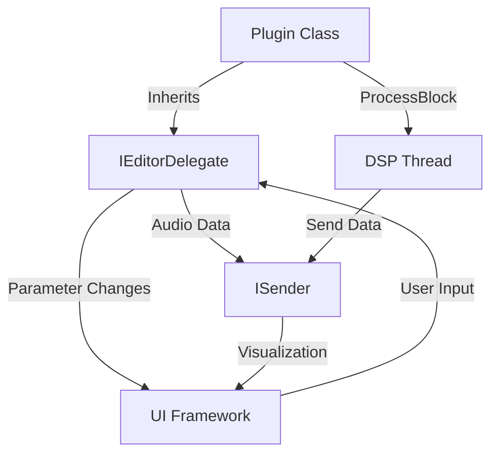

iPlug2 offers multiple approaches to building plugin user interfaces, from traditional vector graphics to modern web and native platform frameworks.

## Available UI Frameworks

<CardGroup cols={2}>
  <Card title="IGraphics" icon="palette" href="/graphics/overview">
    Cross-platform vector graphics with NanoVG or Skia backends
  </Card>
  
  <Card title="SwiftUI" icon="swift" href="/ui-frameworks/swiftui">
    Native macOS/iOS interfaces using Apple's declarative framework
  </Card>
  
  <Card title="Cocoa" icon="apple" href="/ui-frameworks/cocoa">
    Native AppKit/UIKit interfaces with Interface Builder support
  </Card>
  
  <Card title="WebView" icon="globe" href="/ui-frameworks/webview">
    HTML/CSS/JavaScript UIs using native webviews
  </Card>
  
  <Card title="Svelte" icon="fire" href="/ui-frameworks/svelte">
    Modern reactive web UIs with Svelte framework
  </Card>
</CardGroup>

## Choosing a Framework

### IGraphics (Default)

**Best for:** Cross-platform plugins with custom graphics and animations

**Pros:**
- Single codebase for all platforms
- Pixel-perfect rendering
- No web dependencies
- Optimized for audio plugin UIs

**Cons:**
- Custom control library (not native)
- More code for complex layouts

### SwiftUI

**Best for:** macOS/iOS only plugins with modern native UIs

**Pros:**
- Native Apple look and feel
- Declarative syntax
- Automatic dark mode support
- Access to all Apple frameworks

**Cons:**
- macOS/iOS only
- Requires Swift knowledge
- macOS 10.15+ / iOS 13+

### Cocoa

**Best for:** macOS/iOS plugins using Interface Builder

**Pros:**
- Visual layout with Xcode's Interface Builder
- Native controls and styling
- Familiar to iOS/macOS developers

**Cons:**
- macOS/iOS only
- More verbose than SwiftUI
- Separate storyboards for macOS/iOS

### WebView

**Best for:** Rich, web-based UIs with standard web technologies

**Pros:**
- Use standard HTML/CSS/JavaScript
- Rich ecosystem of libraries
- Designer-friendly
- Hot reload during development

**Cons:**
- Larger memory footprint
- Depends on system webview
- Different rendering across platforms

### Svelte

**Best for:** Modern reactive UIs with excellent developer experience

**Pros:**
- Reactive programming model
- Compile-time optimization
- Smaller bundle size than React/Vue
- Great TypeScript support

**Cons:**
- Requires build tooling (Vite)
- Webview overhead
- Additional learning curve

## Architecture Overview

All UI frameworks in iPlug2 share a common architecture:



### Key Concepts

#### 1. Editor Delegates

Each framework uses a specific editor delegate:

- **IGraphics**: `IGraphicsEditorDelegate` (built-in)
- **SwiftUI/Cocoa**: `CocoaEditorDelegate`
- **WebView/Svelte**: `WebViewEditorDelegate`

The delegate handles communication between C++ DSP code and the UI.

#### 2. Parameter Communication

All frameworks use the same parameter communication pattern:

**From UI to DSP:**
1. `BeginInformHostOfParamChangeFromUI()` - Start gesture
2. `SendParameterValueFromUI()` - Send value (normalized 0-1)
3. `EndInformHostOfParamChangeFromUI()` - End gesture

**From DSP to UI:**
- `SendParameterValueFromDelegate()` - Update UI with new value

#### 3. Data Visualization

For non-parameter data (meters, scopes, etc.), use `ISender` classes:

```cpp
// In plugin header
IPeakSender<2> mMeterSender;  // 2 channels

// In ProcessBlock()
mMeterSender.ProcessBlock(outputs, nFrames, kCtrlTagMeter);

// In OnIdle()
mMeterSender.TransmitData(*this);
```

The UI framework receives this data via control messages.

## Platform Support

| Framework | macOS | iOS | Windows | Linux | Web |
|-----------|-------|-----|---------|-------|-----|
| IGraphics | ✓ | ✓ | ✓ | ✓ | ✓ |
| SwiftUI   | ✓ | ✓ | ✗ | ✗ | ✗ |
| Cocoa     | ✓ | ✓ | ✗ | ✗ | ✗ |
| WebView   | ✓ | ✓ | ✓ | ✗ | ✗ |
| Svelte    | ✓ | ✓ | ✓ | ✗ | ✗ |

<Note>
WebView and Svelte support on Windows uses Microsoft Edge WebView2.
</Note>

## Getting Started

Choose the framework that best fits your needs:

<Steps>
  <Step title="Use the duplicate script">
    Copy an example project as your starting point:
    ```bash
    ./duplicate.py IPlugSwiftUI MyPlugin
    ```
  </Step>
  
  <Step title="Configure your plugin">
    Edit `config.h` to set plugin name, manufacturer, etc.
  </Step>
  
  <Step title="Build and run">
    Open the project in your IDE and build.
  </Step>
</Steps>

See the individual framework pages for detailed setup and usage instructions.